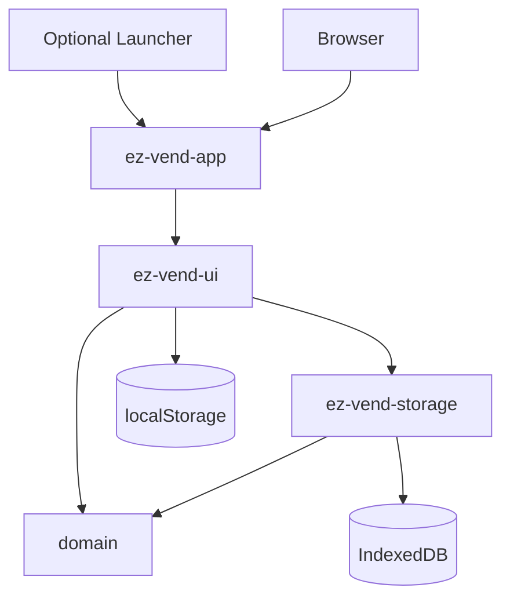
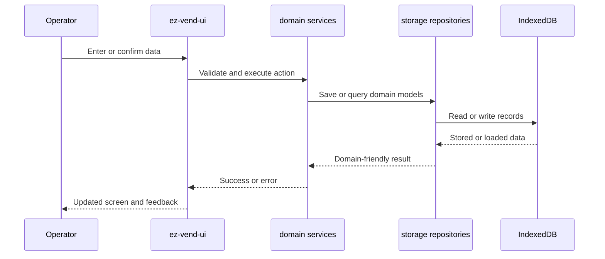
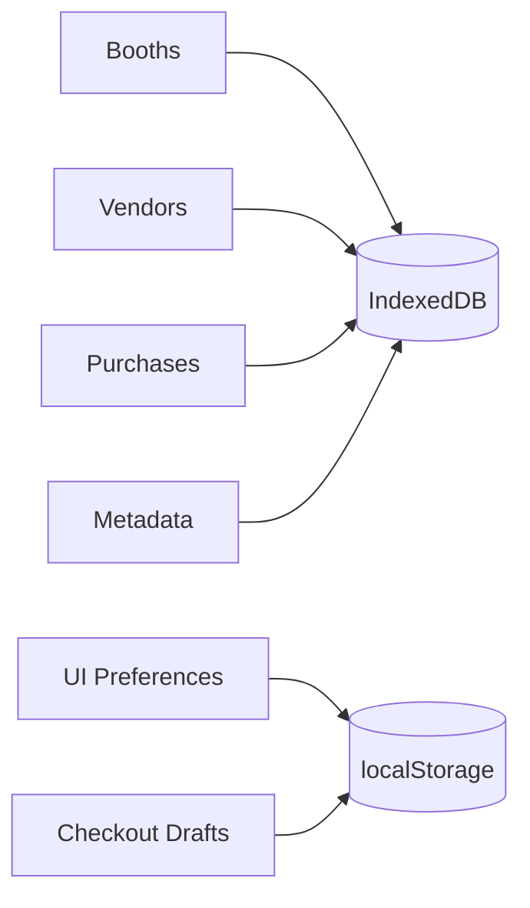

# Architecture Overview

`ez-vend-rs` is a client-side WebAssembly application built as a Rust workspace. This document gives contributors a quick technical map of the system before they dive into the more detailed redesign documents.

## System Shape



ASCII fallback:

```text
Browser or Launcher
        |
        v
  ez-vend-app
        |
        v
   ez-vend-ui
    /        \
   v          v
domain   ez-vend-storage
              /      \
             v        v
      IndexedDB   localStorage
```

## Crate Responsibilities

### `crates/domain`

- owns the core business rules
- defines booth, vendor, purchase, and fee-related models
- contains validation and service-layer behavior
- protects exact decimal behavior for money calculations

### `crates/storage`

- implements repository traits against IndexedDB
- owns export and import behavior for backups
- converts browser storage concerns into domain-facing results

### `crates/ez-vend-ui`

- renders the Leptos UI
- handles routing, operator interaction, and translation wiring
- coordinates async browser-side tasks
- keeps lightweight UI preferences in browser storage where needed

### `crates/ez-vend-app`

- is the WASM entry point
- wires up logging and panic hooks
- mounts the UI into the browser page

### `crates/ez-vend-launcher`

- packages the built app for desktop-style local use
- serves the static bundle locally
- opens the browser and limits duplicate launcher instances per device

## Data Flow



## Design Priorities

### Offline-First Operation

The normal app flow works without a backend service. Booth, vendor, and purchase data are stored locally in IndexedDB so event teams can keep operating even when internet access is poor or unavailable.

### Domain-First Validation

Business-critical behavior such as fee calculation, payout logic, rounding, and validation rules live in `crates/domain`. That keeps core rules testable and prevents operator-facing UI code from becoming the hidden source of truth.

### Small, Focused Crates

The workspace is intentionally split by responsibility instead of collapsing all logic into a single app crate. That makes it easier to test behavior, reason about boundaries, and evolve storage or UI details without reshaping money logic.

### Browser-Native Storage

The app uses:

- IndexedDB for structured persistent application data
- `localStorage` for lighter-weight UI preferences and checkout draft recovery

This keeps the browser-only deployment model practical while still supporting backup and restore through JSON export and import.

## Storage Model



## Validation and Error Handling

The project treats fee and payout behavior as regression-sensitive.

- domain validation happens at the business boundary first
- storage errors are converted at crate boundaries instead of leaking raw browser details upward
- UI code translates errors into operator-facing messages with the existing i18n helpers
- corruption and recovery flows favor safe visibility over silent failure

## Build and Delivery Model

### Development

```bash
cd crates/ez-vend-app
trunk serve
```

### Production Bundle

```bash
cd crates/ez-vend-app
trunk build --release
```

### Optional Desktop-Style Distribution

```bash
cargo build --release -p ez-vend-launcher --locked
```

The launcher distributes the built web app as a locally served bundle, which keeps the runtime simple for operators who prefer a packaged download instead of a hosted URL.

## Where To Go Next

- [Getting Started](docs/GETTING_STARTED.md) for setup and first-run guidance
- [Testing Guide](TESTING.md) for automated and manual validation flows
- [Redesign Summary](docs/redesign/REDESIGN_SUMMARY.md) for the project-level redesign story
- [Detailed Architecture](docs/redesign/02_ARCHITECTURE.md) for the original architecture design document
- [Technical Docs](docs/technical/) for ADRs and deeper implementation notes
